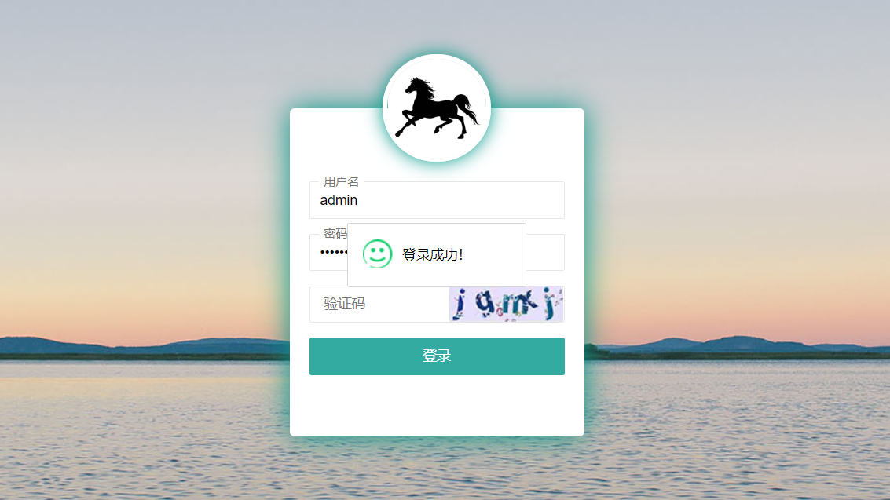

# studentManager

#### 项目介绍
SQL Server数据库大作业，通过这次作业巩固SSM（spring、spring-mvc、mybatis），主要是练习mybatisPlus、pageHealper、spring注解全局异常控制

#### 软件架构
软件架构说明
前段UI
layui
ajax

后端技术
SSM（spring、spring-mvc、mybatis）、mybatisPlus（和mybatis一起使用，能够提供数据库基本、常用增删改查）、pageHelper（数据列表分页）、spring注解、全局异常控制。数据库，使用SQL server。

###运行效果

1. 登录界面（登录成功、失败都会有提示内容）

2. 后台学生列表（可以设置每页显示几条数据）

   

3. 添加学生

   

4. 系统日志

   

5. 编辑学生

   

6. 用户列表

   

#### 使用说明

1. 导入sql文件夹下的sql脚本（数据库使用SQL  Server）
2. 运行依赖tomcat、maven，推荐开发工具idea
3. 在idea上配置tomcat环境、maven环境，引入maven依赖，编译运行

